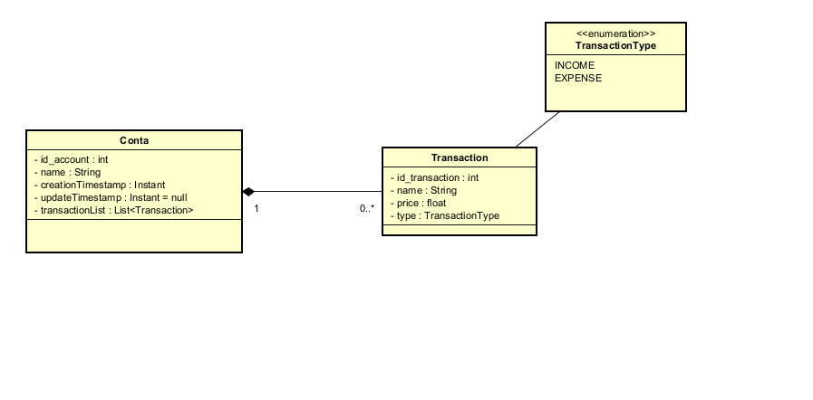

# Projeto Financeiro - Frontend e Backend

---

## Tabela de Conteúdo
- [Links dos Repositórios](#links-dos-repositórios)
- [Visão Geral do Projeto](#visão-geral-do-projeto)
- [Diagramas UML](#diagramas-uml)
  - [Estrutura de Domínio](#estrutura-de-domínio)
  - [Outros Diagramas](#outros-diagramas)
- [Backend](#backend)
  - [Tecnologias Utilizadas](#tecnologias-utilizadas)
  - [Requisitos de Instalação](#requisitos-de-instalação)
- [Frontend](#frontend)
  - [Tecnologias Utilizadas](#tecnologias-utilizadas-1)
  - [Requisitos de Instalação](#requisitos-de-instalação-1)
- [Melhorias Futuras](#melhorias-futuras)
- [Contato](#contato)

---

Bem-vindo ao projeto financeiro! Este repositório contém links e informações sobre os dois componentes principais do sistema:

- **[Backend]**: Construído com Spring Boot e JPA, utilizando MySQL como banco de dados, e gerenciado com Docker Compose.
- **[Frontend]**: Desenvolvido com Angular para fornecer uma interface de usuário rica e responsiva.

---

## Links dos Repositórios

- [Repositório do Backend](https://github.com/thiagoopg/Backend_Spring_JPA)
- [Repositório do Frontend](https://github.com/thiagoopg/Frontend_Angular)

---

## Visão Geral do Projeto

Este é um sistema para controle financeiro pessoal, permitindo gerenciar contas, registrar transações (ganhos e gastos) e visualizar um histórico consolidado. O sistema é dividido em dois repositórios: o backend fornece a API e a lógica de negócios, enquanto o frontend oferece a interface para os usuários finais.

---

## Diagramas UML

Abaixo estão os diagramas UML que ilustram aspectos importantes do projeto.

### Estrutura de Domínio

O diagrama abaixo representa a estrutura principal do sistema, mostrando as entidades usadas no backend para gerenciar contas e transações:



### Outros Diagramas

Em andamento.

---

## Backend

### Tecnologias Utilizadas

- **Spring Boot**
- **Spring Data JPA**
- **MySQL**
- **Docker Compose**
- **Hibernate**

### Requisitos de Instalação

1. **Pré-requisitos**:
   - [Docker](https://www.docker.com/)
   - Java 17 ou superior
   - Maven
2. **Configuração**:
   - Clone o repositório do backend:  
     ```bash
     git clone https://github.com/thiagoopg/Backend_Spring_JPA.git
     cd backend-repo
     ```
3. **Rodando com Docker Compose**:
   - Execute o comando abaixo para inicializar o banco de dados e a aplicação:
     ```bash
     docker-compose up --build
     ```

4. **Execute o projeto**:
   - Execute a aplicação em src/main/BackendApplication.java

---

## Frontend

### Tecnologias Utilizadas

- **Angular**
- **TypeScript**
- **Bootstrap** (ou outro framework CSS, caso aplicável)

### Requisitos de Instalação

1. **Pré-requisitos**:
   - [Node.js](https://nodejs.org/)
   - [Angular CLI](https://angular.io/cli)

2. **Configuração**:
   - Clone o repositório do frontend:  
     ```bash
     git clone https://github.com/thiagoopg/Frontend_Angular.git
     cd frontend-repo
     ```
   - Instale as dependências:
     ```bash
     npm install
     ```

3. **Rodando a Aplicação**:
   - Execute o comando abaixo para iniciar o servidor local:
     ```bash
     ng serve
     ```
   - Acesse a págoma em: `http://localhost:4200`
---

## Melhorias Futuras

- Em andamento.
---

## Contato

Em caso de dúvidas ou sugestões, entre em contato por:
  - Linkedin: [https://www.linkedin.com/in/thiago-adriel-oliveira-de-lima/](Link-do-Linkedin)
  - Email: thiago.a.o.lima@gmail.com
